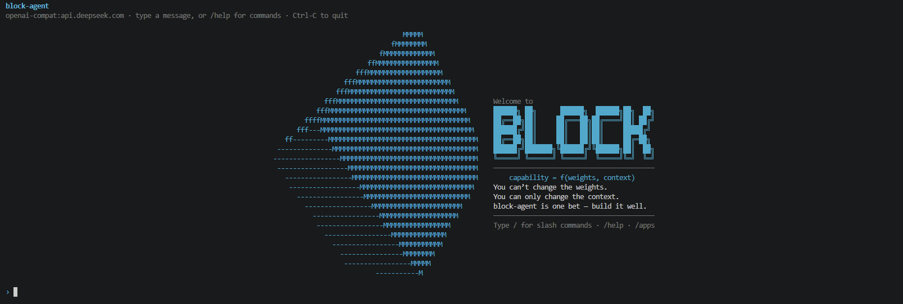
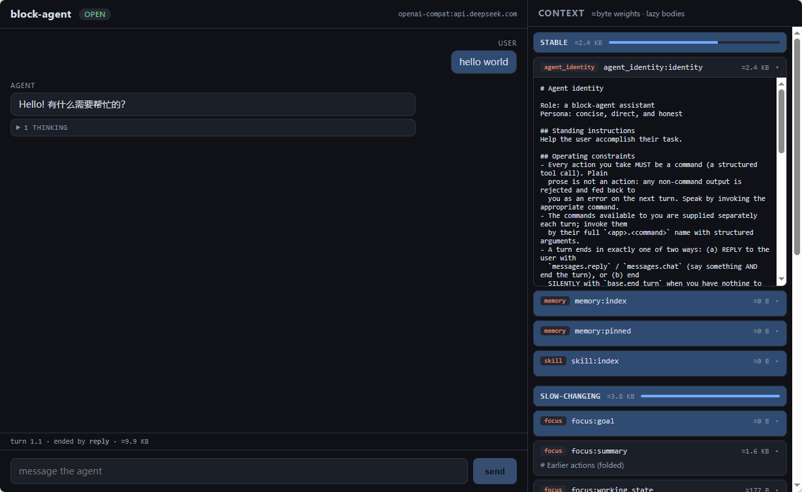

# block-agent

[English](./README.en.md) · **简体中文**

[](https://github.com/Zz-er/BlockAgent/actions/workflows/ci.yml)
[](./LICENSE)

> 像拼装积木一样拼装LLM的上下文

## 简介

LLM的能力由两样东西决定，**训练好的权重**和**输入的上下文**，想要提升LLM的能力，训练权重是固定的，但是我们可以修改提供给LLM的上下文，根据Anthropic内部的研究一个好的上下文管理能让智能体的能力提升至29%，token消耗可以减少至84%，现在常见的agent项目，例如claude code的上下文大致分成几个模块，系统提示词、工具信息、多轮消息历史，并且针对多轮历史消息上下文还会做相关的压缩处理。block-agent把上下文的构建当做**运行时问题**来解决：上下文是一个有结构、有边界、可组合的系统，由运行时来经营，拆成一块块可独立演化的 **Block**——这里的 Block 就是字面意义上的"块"：像积木一样，一块块拼起来，每一块都能单独替换、单独演化。

现在热门的各种agent项目他们的不同都是架构和上下文的不同，理论上通过开发claude code相关的block就可以组装出block-agent版本的claude code通过开发hermes先关的block就可以组装出block-agent版本的hermes。

### 上下文是给模型的界面

API 为程序而生，GUI 为人类而生。轮到模型，它的界面就是**上下文**——agent 对世界的全部感知，都来自每一轮喂进去的那段内容。界面值得被设计，而多数 agent 的上下文从未被设计过：它是一份只增不减的调用转录——每调一次工具追加一份结果，每动一次就重新拉一遍全量表述（浏览器 agent 每步重抓整页快照是最极端的样子），几份几乎相同的内容并排堆着，有效信息被过期信息一点点淹没。这个病如今也有了名字：**context rot**。事后再去删除过期的工具结果是一种解法；block-agent推迟了这些问题的处理，人们可以在使用过程中独立的优化各个上下文模块。

block-agent项目提的不是简单的固定文本，而是一个拥有状态机，block之间可以相互传递信息的**BlockApp**：一个 Block，配上操作它的逻辑。对话历史是一个 Block，工具是一个，记忆是一个，agent 的身份也是一个。给 agent 添一种能力，等于拼上一个新 Block；换一种实现，等于把一个 Block 换成另一个——都不必动它的内核。

写一个 Block，你描述四件事：**状态**（它持有什么、怎样随操作改变）、**呈现**（状态如何变成 agent 看到的那一片界面）、**操作**（对外开放哪些动作；使用者、agent、别的 Block、外部系统都走同一组）、**契约**（声明依赖什么、提供什么；别的 Block 据此对接，而不依赖它是谁）。

### 内置 Block

| Block | 作用 |
|---|---|
| agent_identity | agent 的身份与约束；agent 无法改写自己 |
| messages | 对话历史与自动压缩 |
| tools | 一组内置工具 |
| memory | 本地记忆 |
| memory_letta | 外部语义记忆（与 memory 同接口、可互换） |
| task | 任务列表；可由 agent 或外部系统写入 |
| stats | 跨 Block 统计（契约协作的示例） |

## 快速开始（以 DeepSeek 为例）

```bash
npm install
```

API key 只从环境变量读，绝不写进配置文件、不入库。启动有两种等价的方式，任选其一。

**方式一：命令行 flags**——临时试跑、随手换模型时最顺手。在 shell 里设好 key，直接启动：

```bash
export OPENAI_API_KEY=sk-你的key   # openai-compat 类 provider（含 DeepSeek / 百炼）统一读这个变量
npm start -- --provider openai-compat --model deepseek-chat --base-url https://api.deepseek.com
```

**方式二：`.env` + 配置文件**——把 key 和模型都写进文件，之后启动只需 `npm start`。

① 放 API key——在仓库根建一个 gitignored 的 `.env`，启动时会自动加载（且覆盖同名的 shell 环境变量）：

```bash
# .env（仓库根，已被 .gitignore 忽略）
# 注意：openai-compat 类 provider（含 DeepSeek / 百炼）统一读 OPENAI_API_KEY
OPENAI_API_KEY=sk-你的key
```

② 选 DeepSeek——在仓库根建 `block-agent.config.json`（也被 gitignore）：

```json
{
  "provider": {
    "kind": "openai-compat",
    "model": "deepseek-chat",
    "base_url": "https://api.deepseek.com",
    "thinking_format": "openai_reasoning"
  }
}
```

③ 跑：

```bash
npm start

# 没有 key 也想看它跑（离线，不联网）：
npm start -- --dry-run
```

启动后是一个交互式终端：直接打字 = 给 agent 发消息；以 `/` 开头 = 命令（`/help` 看全部，`/apps` 看 Block）。两种方式可以混用，优先级 flags > 配置文件 > env > 默认。换成 Anthropic 或任意 OpenAI 兼容端点（Ollama / vLLM / 百炼）只需改 provider 与 base_url。




## Web 端对话（浏览器，可选）

除了终端，还可以在浏览器里和 agent 对话。它分两层：一个无界面的后端 `block-agent-serve`（把同一个 agent 用 WebSocket 暴露出来），和一个 Vite + React 的 web 前端（对话界面）。`.env` 与 `block-agent.config.json` 的识别规则与 `npm start` **完全一致**（同一套加载逻辑），所以上面配好的 DeepSeek/key 这里直接复用。

开两个终端，**都在仓库根目录**跑：

```bash
# 终端 1 —— 启后端（端口 4317 要和 web 默认对上）
npm run serve -- --name web --port 4317
# 看到 “listening on ws://127.0.0.1:4317” 即就绪（已加载 .env + block-agent.config.json）

# 终端 2 —— 启 web 前端
npm run web
# Vite 打印一个 http://localhost:5173 之类的地址，浏览器打开它即可对话
```

几点注意：

- **必须 `--port 4317`**——web 前端默认连 `ws://localhost:4317`。想换端口就在跑 web 时设 `VITE_WS_URL`，例：`VITE_WS_URL=ws://localhost:7345 npm run web`。
- 用根脚本 `npm run serve`，**不要**用 `npm run serve -w @block-agent/server`——后者会把工作目录切到包目录，找不到仓库根的 `.env` 与配置文件。
- 仅限本机 loopback：后端无条件把输入按"使用者"身份盖章，只在 `localhost` 上是安全的；未加鉴权前不要绑 `0.0.0.0`。




## 工作目录（root_dir，可选）

默认情况下，`.env`、`block-agent.config.json`、以及所有 BlockApp 的数据（`.block-agent/apps/<id>/`）都落在你启动时所在的目录（当前工作目录 cwd）。**不传任何新参数时行为与以前逐字节一致**——老用户无需改动。

如果你想把一个 agent 进程的全部状态钉在一个明确的根目录（容器挂卷、一机多 agent、把数据从 cwd 解耦），用 `--root-dir`：

```bash
npm start -- --root-dir /srv/agent-a
# 等价：BLOCK_AGENT_ROOT_DIR=/srv/agent-a npm start
```

此后该进程的 `.env`、配置文件、app 数据全部在 `/srv/agent-a` 下。两个指向不同 `--root-dir` 的进程互不干扰；指向**同一** root 的第二个进程会被拒绝启动（并打印持锁进程的 pid），以防两进程交错写坏数据。

几条要点：

- **`BLOCK_AGENT_ROOT_DIR` 必须是真实的 shell/容器环境变量**（ambient env），**不能写进 `.env`**——因为 root 要在加载 `.env` *之前*就定下来（`.env` 本身住在 root 里面）。把它塞进 `.env` 不会生效，这与平常"文件覆盖 env"的直觉相反，是最常见的踩坑点。
- **root 必须已存在**：`--root-dir` 指向一个不存在的目录会**直接报错退出**（防止打错路径时静默新建空目录 = agent 失忆）。确实要新建就加 `--create-root`（例如容器首次启动、root 卷为空但合法）。其下的 `.block-agent/apps` 会按需自动创建。
- **指向全新 root 时不会自动搬运旧数据**。如果你之前在 cwd 下跑、现在显式换到一个新 root，旧的 `.block-agent` / `.env` / 配置不会自动迁移——需要时请手动 `mv` 过去（例：`mv ./.block-agent ./.env ./block-agent.config.json /srv/agent-a/`）。
- 旧的 `--storage-dir` / `BLOCK_AGENT_STORAGE_DIR` 仍作为**已弃用**的别名保留：未显式给 `--root-dir` 时它仍能在 root 内重定向 app 数据；一旦显式给了 `--root-dir`，以 root 为准。
- `--config <path>` 不受 root 重定向影响：绝对路径按原样用，相对路径仍相对 cwd 解析（这是你手指的文件）。

## 教程与文档

想自己拼一个 Block，从 [BlockApp 开发指南](./doc/blockapp-development.md) 开始——它从整个项目的目录结构讲起，告诉你 `apps/` 在哪、一个 Block 由哪几个文件组成，再逐个文件带你写出第一个可用的 Block。完整的使用与开发文档见 [`doc/`](./doc/README.md)。

代码结构：`packages/core`（核心运行时，零运行时依赖）· `packages/cli`（交互式终端）· `apps/*`（内置 BlockApp，含 `apps/memory_letta` 外部记忆对接、依赖隔离）。技术栈：Node 24 · TypeScript · vitest。

## License

[MIT](./LICENSE) © 2026 zzer and BlockAgent contributors
